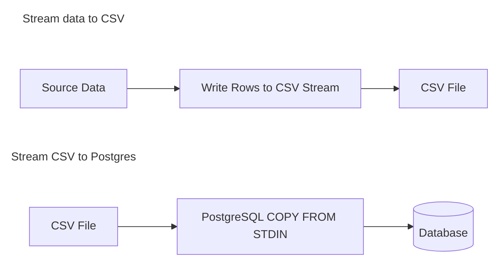

Being able to generate fake data for a project is an important skill. It helps with testing and opens up areas for data exploration.

In this article we will explore creating fake data for a hotel booking platform. The application is written in TypeScript and we are using [Prisma](https://www.prisma.io/) as an ORM.

## The data model

First let's look at the data model. Here we can see 3 tables: hotels, guests, and bookings. This article is going to focus on the first 2.

```sql
CREATE TABLE hotels (
    id bigint GENERATED ALWAYS AS IDENTITY PRIMARY KEY,
    name text NOT NULL,
    total_rooms int NOT NULL
);

CREATE TABLE guests (
    id bigint GENERATED ALWAYS AS IDENTITY PRIMARY KEY,
    first_name text NOT NULL,
    last_name text NOT NULL,
    email text NOT NULL
);

CREATE TABLE bookings (
    id bigint GENERATED ALWAYS AS IDENTITY PRIMARY KEY,
    hotel_id bigint NOT NULL,
    guest_id bigint NOT NULL,
    check_in timestamptz NOT NULL,
    check_out timestamptz NOT NULL
);
```

>[!info] `GENERATED ALWAYS AS IDENTITY`
>You might be more familiar with using `bigserial` for primary keys. But using `GENERATED ALWAYS AS IDENTITY` has some advantages. It is SQL standard compliant and has stricter data integrity because it does not allow manual overrides of ID column. However, if you do want to allow overrides you can use `GENERATED BY DEFAULT`.

### Fake =/= unrealistic

Fake data doesn't need to be purely random data. It is preferable to create at least semi-realistic data in many cases.

However, the more realistic the data the more variables we need to control. There is a fine line to walk where the data is realistic enough to be useful but not so realistic that we need to sink days of developer time into it.

As mentioned before we will only focus on hotels and guests. With that in mind, what criteria would help make our hotel data more realistic?

**Guests**

It is unlikely that you would see "x_42!FKj" as a guest name in the real world. Similarly using "test123" for every email address is not ideal.

If possible we want:
- First and last names that reflect real names.
- Email addresses in the correct format.

**Hotels**

One thing that might help our hotels is to make the name more indicative of real hotels. Consider real hotel names like "Hilton Garden Inn Philadelphia Center City" or "Ramada by Wyndham East Orange."
 
 Our fake data should consist of:
 - hotel chain + location.

We can use the wonderful [faker](https://www.npmjs.com/package/@faker-js/faker) package to help generate values that fit our criteria.

## Prisma seed

Prisma allows you to see the database by writing a `seed.ts` file and using the CLI tool:

```sh
prisma db seed
```

If you want to use a `.env` file you may consider adding [dotenv-cli](https://www.npmjs.com/package/dotenv-cli) to your project and running the command as:

```sh
dotenv -e .env -- prisma db seed
```

The `seed.ts` file calls a main function where you can put all your fake data generation logic. Here's a basic example of what that looks like.

```ts
import { PrismaClient } from "./generated/client";
import { PrismaPg } from "@prisma/adapter-pg";
// ...

const dbUrl = process.env.DATABASE_URL;

const adapter = new PrismaPg({
  connectionString: dbUrl,
});

const prisma = new PrismaClient({ adapter });

main()
  .catch((e) => {
    console.error("❌ Error seeding database:", e);
    process.exit(1);
  })
  .finally(async () => {
    await prisma.$disconnect();
  });

async function main() {
  // ...
}
```

## Creating a few hundred hotels

We are going to generate 500 hotels. That is trivial in the grand scheme of things. With data of that size there are no special tricks required. However, that is not true of guests as we will see.

Prisma offers some nice helper functions to make this easier: `createMany` and `createManyAndReturn`. Using one vs the other comes down to whether or not you need the data after it's been saved to the DB.

In our case we need both the hotel ID and the total number of rooms in the hotel after the hotel has been created. So we use `createManyAndReturn`.

```ts
function createHotels() {
  const hotelData: Prisma.HotelCreateManyInput[] = [];

  for (const _ of range(NUM_HOTELS)) {
    hotelData.push({
      name: getHotelName(),
      totalRooms: faker.number.int({
        min: MIN_HOTEL_ROOMS,
        max: MAX_HOTEL_ROOMS,
        multipleOf: 5,
      }),
    });
  }

  return prisma.hotel.createManyAndReturn({
    data: hotelData,
    select: { id: true, totalRooms: true },
  });
}
```

The `range` function here is just a helper that makes iterating X number of times easier. It is defined as a generator function. If you want to learn more about iterators, check out [this article](https://ericmasi.com/blog/js_iterators/).

```ts
function* range(n: number) {
  for (let i = 0; i < n; i++) {
    yield i;
  }
}
```

You can of course us a regular `for` loop. It is mostly a matter of personal preference.

The `getHotelName` function randomizes some values to give us a name + location combination.

```ts
const hotelNames = [
  "Autograph Collection Hotels",
  "Best Western",
  "Bowman-Biltmore Hotels",
  "Hilton Worldwide",
  "Hyatt Hotels and Resorts",
  // ...
];

const hotelLocationFns = [
  faker.location.street,
  faker.location.city,
  faker.location.county,
];

export function getHotelName(): string {
  const name = faker.helpers.arrayElement(hotelNames);
  const location = faker.helpers.arrayElement(hotelLocationFns)();

  return `${name} ${location}`;
}
```

Finally the `prisma.hotel.createManyAndReturn` function is called.

>[!warning] Limitations of `createMany` and `createManyAndReturn`
>While `createMany` and `createManyAndReturn` are powerful they are not sufficient when your data gets really big. If you try to create millions of rows with these functions your program is likely going to run out of memory.

## Creating millions of guests

Creating the data for guests is conceptually simpler than hotels. The real challenge is that we need to create millions of rows at once. About 2.3 million in fact. If we attempt to do this using our Prisma convenience methods we will surely run out of memory.

So how do we overcome this challenge?

We need to create guests in 2 phases.



By streaming the data to a CSV first we limit the amount of memory we need to create all the fake guests. Then we can leverage PostgreSQL `COPY FROM` to write to the database.

### Stream data to CSV

Our `createGuestData` which handles writing to a CSV looks like this.

```ts
async function createGuestData(path: string) {
  // Open a writable stream to CSV to save guests
  const { write, end } = getStreamWriter(path);

  // Write CSV header
  await write("first_name,last_name,email\n");

  const guestData: string[] = [];

  for (const n of range(NUM_GUESTS)) {
    const firstName = faker.person.firstName();
    const lastName = faker.person.lastName();
    const email = faker.internet.email({
      firstName,
      lastName,
    });

    guestData.push(`${firstName},${lastName},${email}`);

    // Flush chunks of data to disk
    if (guestData.length > 25_000 || n === NUM_GUESTS - 1) {
      console.log(`Flushing guests to disk | ${n + 1} of ${NUM_GUESTS}`);

      await write(guestData.join("\n") + "\n");

      // Reset the array so it can be reused
      guestData.length = 0;
    }
  }

  await end();
}
```

The `getStreamWriter` function is a helper that uses NodeJS standard library functions.

```ts
import {
  createWriteStream,
  // ...
} from "node:fs";
import { once } from "node:events";

// ...

function getStreamWriter(path: string) {
  const output = createWriteStream(path);

  const write = async (chunk: string) => {
    if (!output.write(chunk)) {
      await once(output, "drain");
    }
  };

  const end = async () => {
    output.end();
    await once(output, "finish");
  };

  return { write, end };
}
```

Also notice how we don't write to disc on every iteration of the loop. Rather, we build up an array and flush once we have 25K rows (or on the final iteration).

We also reuse the same `guestData` array on every iteration. When we flush to disk we reset the length of the array to 0. This saves us memory allocations.

```ts
// Flush chunks of data to disk
if (guestData.length > 25_000 || n === NUM_GUESTS - 1) {
  console.log(`Flushing guests to disk | ${n + 1} of ${NUM_GUESTS}`);

  await write(guestData.join("\n") + "\n");

  // Reset the array so it can be reused
  guestData.length = 0;
}
```

### Stream CSV to Postgres

Streaming the CSV to Postgres requires another function from the NodeJS standard library and two additional packages: [pg](https://www.npmjs.com/package/pg) and [pg-copy-streams](https://www.npmjs.com/package/pg-copy-streams).

Fun fact: `pg` is actually used under the hood by Prisma when we create the client with the `PrismaPg` adapter.

The functionality looks like this.

```ts
import pg from "pg";
import { from as copyFrom } from "pg-copy-streams";
import {
  createReadStream,
  // ...
} from "node:fs";

// ...

const pgClient = new pg.Client({
  host: "localhost",
  port: 5432,
  user: postgresUser,
  password: postgresPassword,
  database: postgresDb,
});

// ...

async function createRecordsFromCsv(path: string, query: string) {
  const copyStream = pgClient.query(copyFrom(query));

  const fileStream = createReadStream(path);

  await new Promise((res, rej) => {
    fileStream.pipe(copyStream).on("finish", res).on("error", rej);

    fileStream.on("error", rej);
  });

  fileStream.close();
}
```

With these relatively few lines of code we unlock massive performance gains.

#### Raw SQL and Docker

If your curious, you can actually do this without JavaScript.

The raw SQL would look something like this.

```sql
COPY your_table_name FROM 'your/file/path' WITH (FORMAT csv, HEADER true);
```

But if you're running Postgres inside docker you'd need to pipe the data in or copy the file to the Docker container first.

**Pipe**

```sh
cat /absolute/path/to/your_file.csv | docker exec -i your_postgres_container_name psql -U your_db_user -d your_db_name -c "COPY your_table_name (column1, column2, column3) FROM STDIN WITH (FORMAT csv, HEADER true);"
```

**Copy file**

```sh
docker cp /absolute/path/to/your_file.csv your_postgres_container_name:/your_file.csv

docker exec -it your_postgres_container_name psql -U your_db_user -d your_db_name

COPY your_table_name (column1, column2, column3)
FROM '/your_file.csv'
WITH (FORMAT csv, HEADER true);
```

## Wrapping up

With that we've seen how to create millions of rows in our Postgres DB.

Remember: for small amounts of data the Prisma convenience methods are the way to go. Only reach for the CSV method if you actually need it. Start simple and go from there.

Next time we will see how to create bookings. A topic that will bring new complexities on top of just handling large amounts of data.

Thanks for reading!
