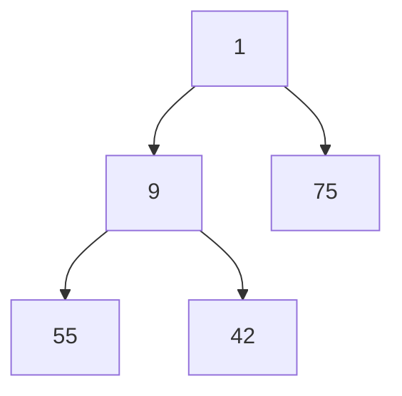
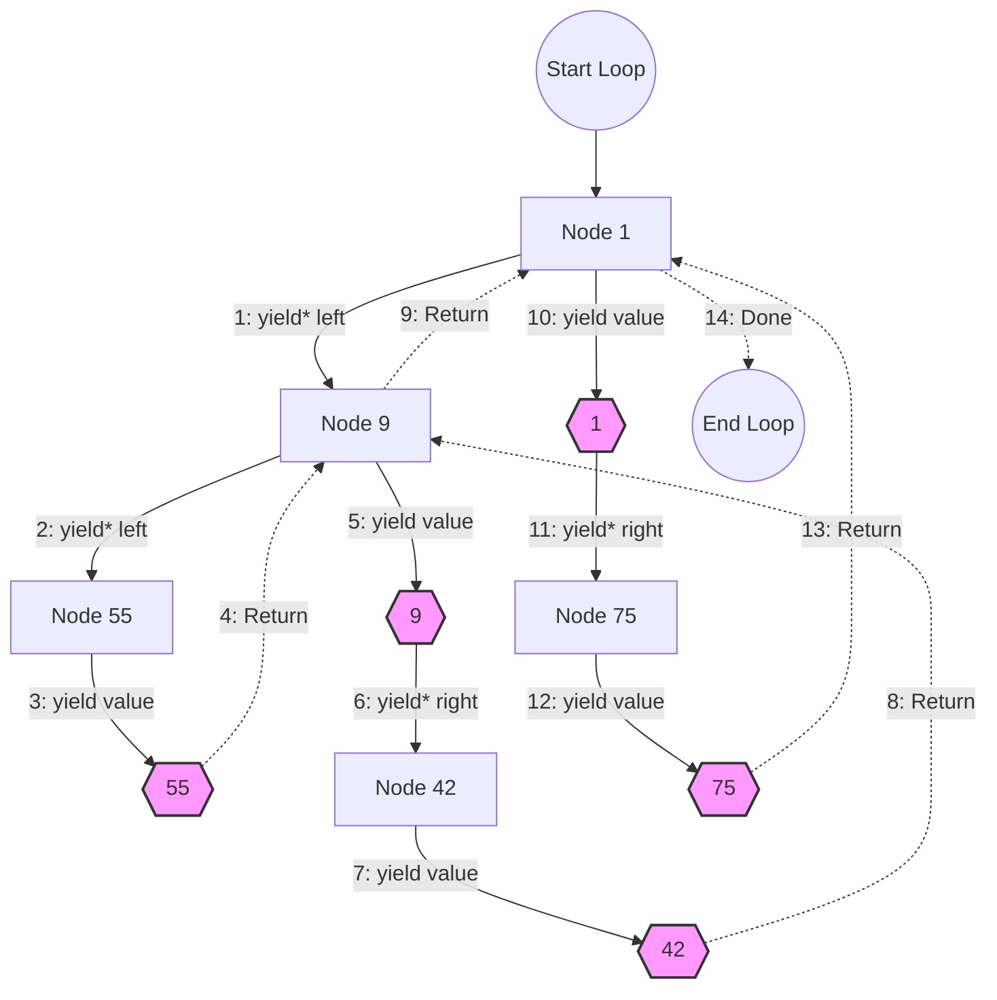

Iterators offer an alternative to the classic `for` loop in JavaScript/TypeScript.

You have probably used them without even knowing it.

```ts
const arr = [1, 2, 3];

// `for...of` loops use iterators
for (const el of arr) {
  // do something
}
```

The `for...of` loop will feature prominently throughout this article but there are several other common use case for iterators such as spread syntax.

```ts
const arr1 = [1, 2, 3];

// This uses an iterator
const arr2 = [...arr1];

console.log(arr2) // [1, 2, 3]
```

We can actually hack this so that the spread operator doesn't work as expected.

```ts
const arr1 = [1, 2, 3];

arr1[Symbol.iterator] = function* () {
  return { value: null, done: true };
};

const arr2 = [...arr1];

console.log(arr2) // []
```

You will understand this example by the end of the article.

Here's one final demonstration before we get into it for real. You *can't* spread an object into an array right?

```ts
const obj = { some: "value", testing: true };

const arr = [...obj]; // Uncaught TypeError: obj is not iterable
```

Well, we can fix the type error by using the same hack from before.

```ts
const obj = { some: "value", testing: true };

obj[Symbol.iterator] = function* () {
  return { value: null, done: true };
};

const arr = [...obj];

console.log(arr) // []
```

This doesn't do anything useful of course. Not yet. But it should highlight how often we unknowingly use iterators.

## What is an iterator?

This can be a little confusing but bear with me.

There are 2 "iteration protocols." They are: "iterable" and "iterator." You can read more about them [here](https://developer.mozilla.org/en-US/docs/Web/JavaScript/Reference/Iteration_protocols).

> [!warning] Edit
> Previously the next paragraph erroneously stated: "In almost every case imaginable an object should implement ***both*** protocols."
> I have added a new section at the end to show why that is not necessarily the case.

To *grossly oversimplify*, the difference is that "iterable" defines what happens when you use `for...of` and "iterator" is a standardized way of producing a sequence of values.

We will see both in action throughout the article.

## Our first iterator

Let's create our first iterator.

```ts
const iter = {
  // Implement the "iterable" protocol
  [Symbol.iterator]() {
    return this;
  },

  // Implement the "iterator" protocol
  next(): IteratorResult<any, null> {
    return { value: null, done: true };
  },
};

for (const el of iter) {
  console.log(el);
}
```

If you run this code nothing happens. There is no error and nothing is logged.

We can see from the comments that `[Symbol.iterator]()` is a special method that implements the "iterable" protocol. This method must return an object that implements the "iterator" protocol.

By implementing a `next` method which returns an `IteratorResult` the object itself also conforms to the "iterator" protocol. That is why we can return `this` inside of `[Symbol.iterator]()`. Because the object itself is both an iterable and an iterator, an iterable iterator.

To really, really drive this point home – that there are two different protocols – we can decompose the example into two objects without issue.

```ts
const iterator = {
  // Implement the "iterator" protocol
  next(): IteratorResult<any, null> {
    return { value: null, done: true };
  },
};

const iterable = {
  // Implement the "iterable" protocol
  [Symbol.iterator]() {
    return iterator;
  },
};

for (const el of iterable) {
  console.log(el);
}
```

To recap. There are 2 iteration protocols. As a general rule you want to implement both. The simplest iterator implementation requires 2 methods: `[Symbol.iterator]()` and `next`.

## Count to 10

Let's make our iterator do something.

We can count to 10 by tracking an internal state.

```ts
const iter = {
  [Symbol.iterator]() {
    return this;
  },

  value: 0,

  next(): IteratorResult<number, null> {
    this.value++;
    if (this.value > 10) {
      return { value: null, done: true };
    }
    return { value: this.value, done: false };
  },
};

for (const el of iter) {
  console.log(el); // 1, 2, 3, 4 ...
}
```

Notice that we now have two possible return values:
- `{ value: null, done: true }`
- `{ value: this.value, done: false }`

If the internal state is less than or equal to 10 then we return `{ value: this.value, done: false }`. Returning `done: false` indicates there are more values. Inside the `for...of` loop we are only concerned with `value`.

The base case is `{ value: null, done: true }`. This tells our `for...of` loop that we are done iterating and there are no more values. The `null` value is not printed to the console.

It is important to understand that both `done` and `value` are optional per [the protocol](https://developer.mozilla.org/en-US/docs/Web/JavaScript/Reference/Iteration_protocols#the_iterator_protocol). But we are being explicit here (and using proper types) for the sake of clarity and education.

As a final note that you can do the same thing with a class.

```ts
class Iter {
  value = 0;

  [Symbol.iterator]() {
    return this;
  }

  next(): IteratorResult<number, null> {
    this.value++;
    if (this.value > 10) {
      return { value: null, done: true };
    }
    return { value: this.value, done: false };
  }
}
```

## Iterate backwards

Let's do something slightly more useful.

Iterating through an array from the first index to the last is trivial. That's the default behavior of `for...of`. But if you want to loop backwards you'd normally need to implement a traditional `for` loop. We can create an iterator for that.

```ts
function createBackwardsIter<T>(arr: Array<T>) {
  let idx = arr.length - 1;

  return {
    [Symbol.iterator]() {
      return this;
    },

    next(): IteratorResult<T, null> {
      if (idx < 0) {
        return { value: null, done: true };
      }

      const result = { value: arr[idx]!, done: false } satisfies IteratorResult<
        T,
        null
      >;

      idx--;

      return result;
    },
  };
}

const arr = [1, 2, 3, 4, 5, 6];

const iter = createBackwardsIter(arr);

for (const el of iter) {
  console.log(el); // 6, 5, 4, 3, 2, 1
}

console.log(arr); // [1, 2, 3, 4, 5, 6]
```

The function takes in an array of any type and returns an iterator that will loop backwards in `for...of`. Notice also how the original array is untouched. If we use this utility we never need to write another `for` loop using `arr.length - 1`. But whether or not it is worth it is up to you.

## Iterable binary tree

Up until now we have used simple objects and arrays. Let's create a custom iterable data structure.

A binary tree is a common data structure that doesn't have a native JS/TS implementation. We can implement a simple binary tree as an iterator so that we can loop through all the nodes. In this case we will use in-order/infix traversal when we loop through the nodes using `for...of`.

Here's our example tree:



And our expected output is `55, 9, 42, 1, 75`.

Now let's implement the functionality. Note: we will significantly improve upon this implementation later in the article.

```ts
class TreeNode {
  left: TreeNode | null = null;
  right: TreeNode | null = null;
  value: number = NaN;

  private nodes: Array<TreeNode> = [];
  private idx = 0;

  constructor(value: number) {
    this.value = value;
  }

  [Symbol.iterator]() {
    return this;
  }

  next() {
    if (this.nodes.length == 0) {
      this.nodes = this.traverse(this);
      this.idx = 0;
    }

    if (this.idx >= this.nodes.length) {
      return { value: null, done: true };
    }

    const node = this.nodes[this.idx]!;

    const result = { value: node.value, done: false };

    this.idx++;

    return result;
  }

  private traverse(node: TreeNode): Array<TreeNode> {
    const result: Array<TreeNode> = [];

    if (node.left) {
      result.push(...this.traverse(node.left));
    }

    result.push(node);

    if (node.right) {
      result.push(...this.traverse(node.right));
    }

    return result;
  }
}

const root = new TreeNode(1);
const left = new TreeNode(9);
left.left = new TreeNode(55);
left.right = new TreeNode(42);
root.left = left;
root.right = new TreeNode(75);

for (const val of root) {
  console.log(val); // 55, 9, 42, 1, 75
}
```

The implementation is fairly straightforward. Each node has a value and can have a left and/or right child.

Before we can iterate we need to construct an array of nodes using the private `traverse` method. This recursive method builds up the list of nodes by first visiting the left branch of each node, then the node itself, then the right branch of the node.

Each time the `next` function is called we use an internal index to return the value of the next node in the sequence. We do this until we have visited every node in the `nodes` array and then stop iteration using our convention of returning `{ value: null, done: true }`.

This works but it's not particularly easy to follow and not terribly efficient given that we need to construct an array of nodes before we iterate. Luckily there is another language feature that can help us here.

## Generators

You may recall this example from the beginning.

```ts
const arr1 = [1, 2, 3];

arr1[Symbol.iterator] = function* () {
  return { value: null, done: true };
};
```

The `function*` denotes a generator function. However, the example doesn't take advantage of their special properties.

Let's look at a simple generator function to get a sense of what makes them special.

```ts
function* gen() {
  yield 1;
  yield 2;
  yield 3;
}
```

Here we see the `yield` keyword which is a special keyword we can use with generators. The idea is that every time we call a generator we should get a different value. Let's try it.

```ts
console.log(gen(), gen(), gen()); // {}, {}, {}
```

That's strange. Clearly this is not like a normal function.

Let's take a look at the prototype.

```ts
console.log(gen.prototype);

// Generator {
//   next: [Function: next],
//   return: [Function: return],
//   throw: [Function: throw],
//   toArray: [Function: toArray],
//   forEach: [Function: forEach],
//   some: [Function: some],
//   every: [Function: every],
//   find: [Function: find],
//   reduce: [Function: reduce],
//   map: [Function: map],
//   filter: [Function: filter],
//   take: [Function: take],
//   drop: [Function: drop],
//   flatMap: [Function: flatMap],
//   [Symbol(Symbol.iterator)]: [Function: [Symbol.iterator]],
//   [Symbol(Symbol.dispose)]: [Function: [Symbol.dispose]],
// }
```

There's a lot going on here, but we can see clearly that the generator implements the `next` and `[Symbol.iterator]()` methods. Maybe we can use it in a `for...of` loop?

```ts
for (const el of gen()) {
  console.log(el); // 1, 2, 3
}
```

Success!

We have discovered something important: generators are iterators.

Let's look at a more practical example. Say we want to write an iterator to produce every number from 1 to n. We can do this easily with a generator.

```ts
function* range(max: number) {
  for (let i = 1; i <= max; i++) {
    yield i;
  }
}

for (const el of range(6)) {
  console.log(el); // 1, 2, 3, 4, 5, 6
}
```

Generators are not limited to yielding values though. Generators can also yield iterators. To do this we need to use the special `yield*` syntax. Here's an example.

```ts
const obj = {
  consumed: false,

  [Symbol.iterator]() {
    return this;
  },

  next() {
    if (this.consumed) {
      return { value: null, done: true };
    }
    this.consumed = true;
    return { value: "super special value", done: false };
  },
};

function* gen() {
  yield* obj;
}

for (const el of gen()) {
  console.log(el); // "super special value"
}
```

Here we see a basic iterator like all the others we previously implemented. Nothing new there. But the generator function yields this iterator such that we ultimately get the iterator's value when we loop using `for...of`.

We can of course take this a step further. As we have seen, generators are iterators. So a generator can yield a generator.

```ts
function* gen1() {
  yield "look mom no hands!";
}

function* gen2() {
  yield* gen1();
}

for (const el of gen2()) {
  console.log(el); // "look mom no hands!"
}
```

This may seem silly but it opens the door to a major improvement for our `TreeNode`.

## Refactoring TreeNode

The previous `TreeNode` implementation was verbose and inefficient. However, we can refactor using our new knowledge of generators.

```ts
class TreeNode {
  left: TreeNode | null = null;
  right: TreeNode | null = null;
  value: number = NaN;

  constructor(value: number) {
    this.value = value;
  }

  // The `TreeNode` is iterable because of `[Symbol.iterator]()`
  // Because it is a generator function, each call to `[Symbol.iterator]()` produces a new iterator
  *[Symbol.iterator](): IterableIterator<number> {
    // 1. Traverse the left subtree
    if (this.left) {
      // Yields entire node not just value
      yield* this.left;
    }

    // 2. Visit the current node
    // Yields the value of the current node
    yield this.value;

    // 3. Traverse the right subtree
    if (this.right) {
      // Yields entire node not just value
      yield* this.right;
    }
  }
}

const root = new TreeNode(1);
const left = new TreeNode(9);
left.left = new TreeNode(55);
left.right = new TreeNode(42);
root.left = left;
root.right = new TreeNode(75);

for (const val of root) {
  console.log(val); // 55, 9, 42, 1, 75
}
```

This is far less code than before but it does seem a bit magical. Let's look at a simpler example.

```ts
class Node {
  *[Symbol.iterator]() {
    yield 1;
  }
}

const n = new Node();

console.log(n[Symbol.iterator]().next()); // { value: 1, done: false }
```

Let's break it down.

- `*[Symbol.iterator]()` means that we Implement the "iterable" protocol.
- Because `*[Symbol.iterator]()` is a generator function, calling the instance method `n[Symbol.iterator]()` returns a generator.
- Generators implement the `next` method meaning they implement the "iterator" protocol.
- Calling `n[Symbol.iterator]().next()` yields `{ value: 1, done: false }`.
- This can be used in `for...of`.

We should now have a better understanding of what is happening in our new `TreeNode`.

```ts
*[Symbol.iterator](): IterableIterator<number> {
  if (this.left) {
    yield* this.left;
  }

  yield this.value;

  if (this.right) {
    yield* this.right;
  }
}
```

If the node has a left child we yield the child node itself. This is because each `TreeNode` is itself an iterator so we can use it with `yield*` syntax.

After we check for a left child we can yield the value of the current node. This is a case that applies to all nodes including leaf nodes in the tree.

Finally, if there is a right child we yield the node similar to what we did with the left child.

Here's a diagram showing the sequence of yields.



## Conclusion

Now you should have a good understanding of iterators and generators. If you want to learn even more, consider taking the plunge into the world of async iterators. But we'll end it here for now.

Thanks for reading!

---

## Iterable iterator clarification

This section was added based on feedback I received on [Reddit](https://www.reddit.com/r/learnjavascript/comments/1thnal3/i_wrote_an_article_about_javascript_iterators/). I want to expand on the idea of "iterable iterators". That is to say: objects that implement both iteration protocols.

Let's revisit an earlier example.

```ts
const iter = {
  [Symbol.iterator]() {
    return this;
  },

  value: 0,

  next(): IteratorResult<number, null> {
    this.value++;
    if (this.value > 10) {
      return { value: null, done: true };
    }
    return { value: this.value, done: false };
  },
};
```

If we use this in a `for...of` loop we get the expected result.

```ts
for (const el of iter) {
  console.log(el); // 1, 2, 3, 4 ...
}
```

But what happens if we iterate twice?

```ts
for (const el of iter) {
  console.log(el); // 1, 2, 3, 4 ...
}

for (const el of iter) {
  console.log(el); //
}
```

The second time no values are logged to the console.

What's going on?

Often iterators are written in such a way that when they are consumed they produce no more values. In the case of the custom iterator above once we reach 10 we always return `{ value: null, done: true }`. If we try to iterate over the object again we get nothing because we are "done."

We can see the same behavior with generator functions.

```ts
function* gen() {
    yield 1
    yield 2
    yield 3
}

const iter = gen();

for (const el of iter) {
    console.log(el); // 1, 2, 3
}

for (const el of iter) {
    console.log(el); //
}
```

You could modify the custom iterator to produce new values after it has been consumed.

```ts
const iter = {
  [Symbol.iterator]() {
    return this;
  },

  value: 0,

  next(): IteratorResult<number, null> {
    this.value++;
    if (this.value > 10) {
	  this.value = 0; // Reset the value to allow this iterator to be reused.
    
      return { value: null, done: true };
    }
    return { value: this.value, done: false };
  },
};
```

So depending on your use case you might want one-and-done behavior or you might want to be able to iterate many times.

Iterating multiple times can be achieved using the `*[Symbol.iterator]()` pattern. Here's our simple example from earlier for context.

```ts
class Node {
  *[Symbol.iterator]() {
    yield 1;
  }
}

const n = new Node();

for (const el of n) {
  console.log(el); // 1
}

for (const el of n) {
  console.log(el); // 1
}
```

This highlights the need to think carefully about iterator behavior. It is a powerful tool but if you're not careful you can introduce unexpected behavior.

Thanks again for reading!
